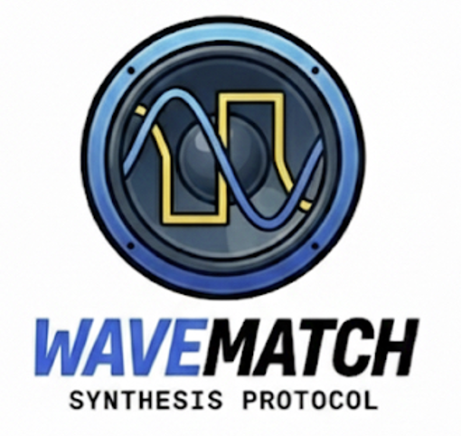
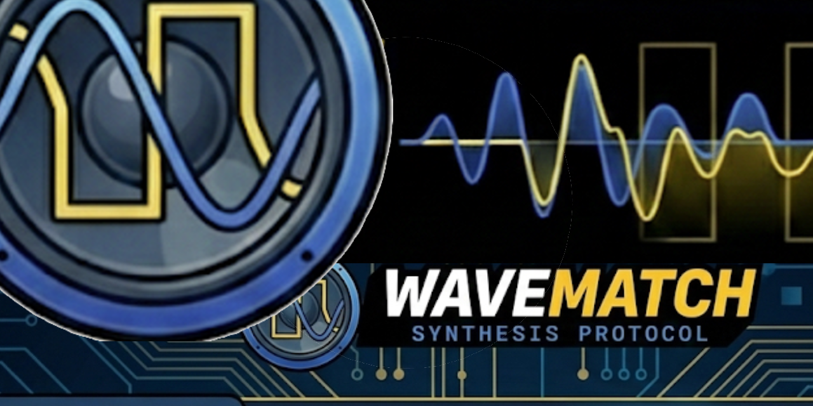
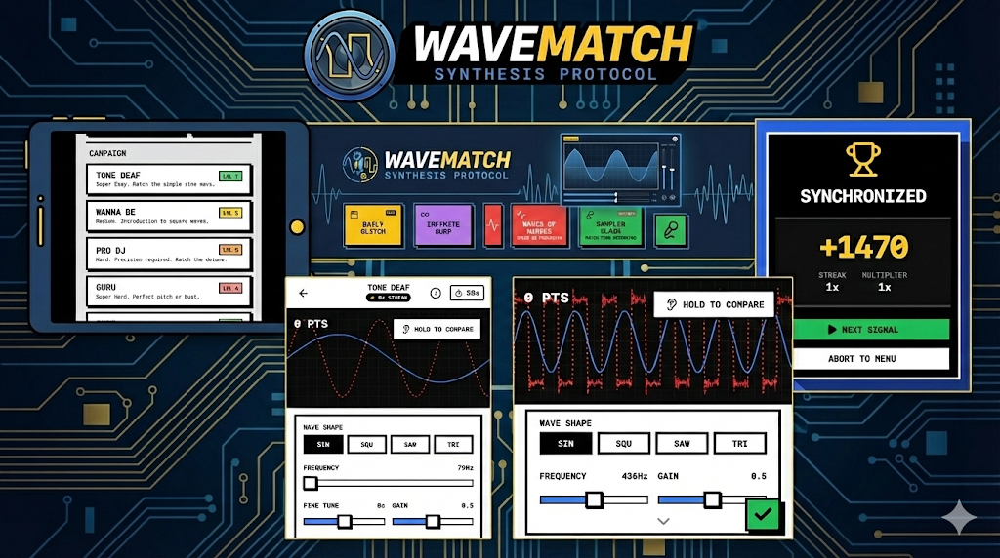

# WaveMatch: Audio Synthesis Puzzle

<p align="center">
  
</p>

Master auditory perception. Sculpt sound. Match the signal.

[**▶ Play the Game (Live Demo)**](#)
*https://benneberg.github.io/wavematch/*


<p align="center">
  
  
</p>

---

## Overview

**WaveMatch** is a neo-brutalist audio puzzle game that trains perception in waveform analysis and sound synthesis. Built directly on the Web Audio API without third-party audio libraries, the gam[...]  

WaveMatch combines education, intuition, and arcade-like pressure into a clean, modern audio-visual experience.

---

## Game Objectives

Match your **User Signal** (blue) to the **Target Signal** (red) by adjusting frequency, gain, waveform shape, detuning, and filters.

Players are evaluated across:

1. **Visual Alignment** — Match waveform geometry.
2. **Aural Comparison** — Use “Hold to Compare” to hear differences.
3. **Accuracy Threshold** — Achieve **85%+ match** to clear a level.
4. **Streak Mechanics** — Maintain streaks for exponential score multipliers.

---

## Game Modes

### 1. Campaign Mode

Progress through four difficulty tiers:

* **Tone Deaf** — Sine waves
* **Wanna Be** — Square waves
* **Pro DJ** — Sawtooth waves with detuning
* **Guru** — Triangle wave precision puzzles

### 2. Daily Glitch

A daily, global challenge generated by date-seeded levels. One attempt per day.

### 3. Infinite Surf

Endless arcade survival. Each cleared puzzle adds time to the clock.

### 4. Waves of Nerves

A speedrun mode: time decays rapidly; final score = *Time Remaining × Accuracy*.

### 5. Sampler Clash (Experimental)

Record your voice or upload audio. The engine warps your sample, and you must match it using playback speed and filter controls.

---

## Controls & Mechanics

* **Wave Shape** — Sine, Square, Sawtooth, Triangle
* **Frequency / Playback Speed** — Pitch control; affects waveform width
* **Gain** — Volume; affects waveform height
* **Fine Tune** — Cents-level pitch adjustments
* **Filter Cutoff** — Available in sampler mode
* **“Hold to Compare”** — A/B comparison of target vs. user signal

---

## Technology Stack

WaveMatch uses a fully custom audio engine with no external synthesis frameworks.

* **Framework:** React 19
* **Language:** TypeScript
* **Styling:** Tailwind CSS (custom neo-brutalist design)
* **Audio:** Native Web Audio API

  * `OscillatorNode` (signal synthesis)
  * `AnalyserNode` (FFT visualization)
  * `BiquadFilterNode` (filtering)
  * `MediaRecorder` (microphone sampling)
* **Other:** Lucide React icons, Vite, modern browser APIs

---

## Mobile Experience

Designed for full usability on touch devices:

* 100dvh layout prevents mobile browser chrome issues
* Enlarged touch areas for sliders
* Floating “Commit” button for thumb-reach ergonomics

---

## Installation & Development

Clone the repository and install dependencies:

```
npm install
```

Start the development server:

```
npm run dev
```

Build for production:

```
npm run build
```

---

## Current Status (v1.0)

This is the first public release.

### Notes & Limitations

* Best performance in Chrome, Edge, and Safari.
* Microphone access requires HTTPS (iOS especially).
* High scores and progress stored locally on device for this first version.

---

## Roadmap

* Online global leaderboards
* ADSR envelopes, LFOs, and advanced modulation
* Expanded sampler tools and filter options
* PWA installable version
* Potential collaboration with music-tech brands for educational integrations

---

## Author

**Lukas Benneberg**
Creator, Developer, and Audio Interaction Designer

---

## License

This project is licensed under the **MIT License**.

```
MIT License

Copyright (c) 2025 Lukas Benneberg

Permission is hereby granted, free of charge, to any person obtaining a copy of this software and associated documentation files (the "Software"), to deal
in the Software without restriction, including without limitation the rights
to use, copy, modify, merge, publish, distribute, sublicense, and/or sell
copies of the Software, and to permit persons to whom the Software is
furnished to do so, subject to the following conditions:

[standard MIT text continues…]
```

---

## Acknowledgements

Created as experimentation, learning by doing, curiosity, and the joy of understanding sound by shaping it with your own hands and ears.

---
